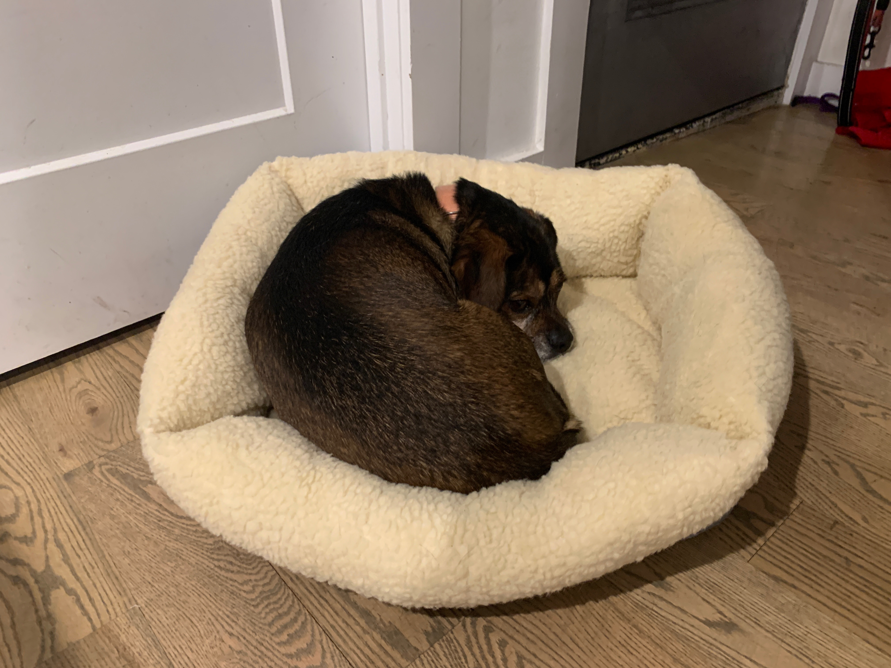

```{r setup, include=FALSE}
knitr::opts_chunk$set(echo = TRUE)
```

 
My name is Sully and this is my soft bed.

<br></br>


My name is Laika and I love sticks!

<br />
<hr />
<p style="text-align: center;"><span style="color: #808080;">Copyright &copy; 2019 Gagarin Zhao</p>

<link rel="stylesheet" href="https://cdnjs.cloudflare.com/ajax/libs/font-awesome/4.7.0/css/font-awesome.min.css">

<p style="text-align: center;">
    <a href="https://twitter.com/gagarinzhao" class="fa fa-twitter"></a>
    <a href="https://www.linkedin.com/in/gagarinzhao/" class="fa fa-linkedin"></a>
    <a href="https://github.com/gagarinzhao/" class="fa fa-github"></a>
    <a href="mailto:<gz2281@cumc.columbia.edu>" class="fa fa-envelope"></a>
</p>
<br />