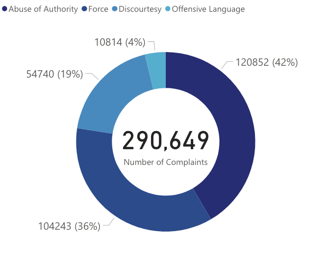

```{r setup, include=FALSE}
knitr::opts_chunk$set(echo = TRUE)
```
<center>

<div style="display: flex; justify-content: center;">


</div>


On August 20th 2020, 323,911 accusations of N.Y.P.D. misconduct were released online. I've done my best here to make sense of it in a visual way for more people to understand and interact with the massive amount of data.

<i>You may make two or more selection in filters by holding down cmd/ctrl.</i>

<iframe width="1024" height="612" src="https://app.powerbi.com/view?r=eyJrIjoiNWQ2YTY2NmQtYjZiNi00YmFhLWIyNGYtMGVlOGU0OWZkMzM0IiwidCI6ImUzM2UzZGFmLThkMGQtNDJjYy1hZTgxLTg4NjA2YmZiMGI5NyJ9&pageName=ReportSection" frameborder="0" allowFullScreen="true"></iframe>
</center>
<left>
<i> Note: Some of the rows contained no information about the complaint aside from the officer's information, and were therefore not reflected in the total number of complaints. This dashboard is best viewed on desktop. Raw data collected from NYCLU's [GitHub repository](https://github.com/new-york-civil-liberties-union/NYPD-Misconduct-Complaint-Database). Data analysis done with Microsoft Excel and visualization performed using Microsoft PowerBI.</i>

</left>